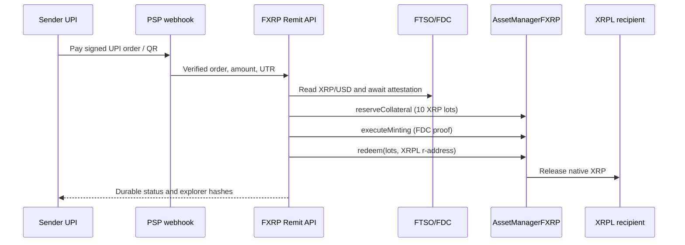

# FXRP Remit — hackathon readiness

## Implemented in this repository

- Durable transfer records in `.data/transfers.json` (replace this adapter with SQLite/Postgres for deployment).
- Signed Razorpay/Cashfree webhook hooks, demo-mode separation, amount/order matching, duplicate protection, and idempotency keys.
- Paddle Billing transaction creation in INR plus `Paddle-Signature` verification for `transaction.completed` webhooks.
- Retry endpoint for payment-verified failures, manual-review state, retry counters, and pipeline error auditing.
- FTSO v2 pricing, current Coston2 FXRP lot sizing (10 XRP per lot), AssetManager registry resolution, FDC proof input, mint, and redeem calls.
- XRPL classic-address validation and configurable INR safety limits.

## On-chain evidence (Coston2 testnet)

All transactions verified on Flare's Coston2 testnet explorer.

### Mint (XRPL → FXRP)

| Field | Value |
|---|---|
| **XRPL Payment TX** | `4A7C34D8F00A0618577C40F6D70CE623903265975B73709D407DFC3F270A29CD` |
| **XRPL Sender** | `rK7Ex4n9LYHReCtvnA6z9QMeZiAGrmCyMt` |
| **Core Vault XRPL** | `rDhpmiPq4BVBDWMVdSrmkgt8thKyRzGV1p` |
| **Amount Sent** | 10.2 XRP |
| **FDC Attestation Round** | 1425199 |
| **Mint TX (EVM)** | `0xfa1254104ba94aa409a3d6e7bcaf905e0d4f07b388b22d87813120d373bedc57` |
| **Mint Explorer** | https://coston2-explorer.flare.network/tx/0xfa1254104ba94aa409a3d6e7bcaf905e0d4f07b388b22d87813120d373bedc57 |
| **Executor EVM** | `0x8070C21dBD21BE7Fe0956681e0Bfb0d8C5544186` |
| **Agent** | `0x103b384064ae85577127097a7ccadfd6fb13f437` |
| **Event** | `DirectMintingExecuted` (block 34043936) |
| **FXRP Minted** | 10 FXRP (10,000,000 UBA) |

### Redeem (FXRP → XRPL)

| Field | Value |
|---|---|
| **Redeem TX (EVM)** | `0x594a2d27f1926e669b40d065611cc06aa55ad9aff1a6cb341c66b8960f72b095` |
| **Redeem Explorer** | https://coston2-explorer.flare.network/tx/0x594a2d27f1926e669b40d065611cc06aa55ad9aff1a6cb341c66b8960f72b095 |
| **Executor EVM** | `0x8070C21dBD21BE7Fe0956681e0Bfb0d8C5544186` |
| **XRPL Recipient** | `rK7Ex4n9LYHReCtvnA6z9QMeZiAGrmCyMt` |
| **Lots Redeemed** | 1 (10 XRP) |
| **Gas Used** | 442,342 |
| **Status** | SUCCESS |

### Contract addresses (Coston2)

| Contract | Address |
|---|---|
| AssetManagerFXRP | `0xc1Ca88b937d0b528842F95d5731ffB586f4fbDFA` |
| FXRP Token | `0x0b6A3645c240605887a5532109323A3E12273dc7` |
| FdcHub | `0x48aC463d7975828989331F4De43341627b9c5f1D` |
| FdcVerifier | `https://fdc-verifiers-testnet.flare.network` |
| DA Layer | `https://ctn2-data-availability.flare.network` |
| Executor | `0x8070C21dBD21BE7Fe0956681e0Bfb0d8C5544186` |

## Architecture

Never commit a mainnet private key or fabricated FDC proof. The demo webhook is marked with `x-flare-demo` and can be disabled with `UPI_DEMO_MODE=false`.
