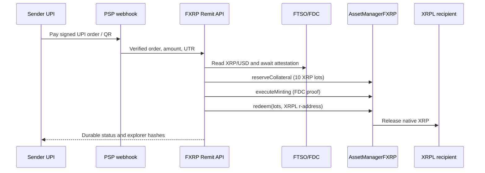

# FXRP Remit — hackathon readiness

## Implemented in this repository

- Durable transfer records in `.data/transfers.json` (replace this adapter with SQLite/Postgres for deployment).
- Signed Razorpay/Cashfree webhook hooks, demo-mode separation, amount/order matching, duplicate protection, and idempotency keys.
- Paddle Billing transaction creation in INR plus `Paddle-Signature` verification for `transaction.completed` webhooks.
- Retry endpoint for payment-verified failures, manual-review state, retry counters, and pipeline error auditing.
- FTSO v2 pricing, current Coston2 FXRP lot sizing (10 XRP per lot), AssetManager registry resolution, FDC proof input, mint, and redeem calls.
- XRPL classic-address validation and configurable INR safety limits.

## External evidence still required

1. Use a funded Coston2-only executor (`EXECUTOR_PK`, agent vault, FXRP fee allowance).
2. Run an XRP/FDC attestation worker and set `FASSET_MINT_PROOF_URL`.
3. Configure Razorpay or Cashfree signed webhooks for automatic UPI verification.
4. Capture one real Coston2 mint hash and one redemption hash, then add explorer links and contract/agent addresses to the submission.

Never commit a mainnet private key or fabricated FDC proof. The demo webhook is marked with `x-flare-demo` and can be disabled with `UPI_DEMO_MODE=false`.

For Paddle, create an INR checkout/payment link and notification destination in the Paddle dashboard, then set `UPI_PSP=paddle`. Paddle’s UPI method is available for INR checkouts where the customer address is in India; webhook confirmation must be based on the signed `transaction.completed` event, not a browser redirect.

## Architecture

